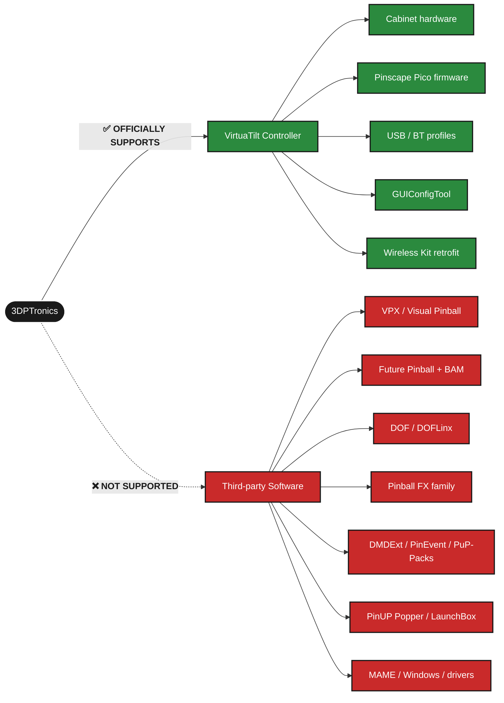

# VirtuaTilt Configuration Guides

> [!IMPORTANT]
> **3DPTronics supports the VirtuaTilt controller hardware only.** These guides are a *compendium* to help you connect your VirtuaTilt to third-party pinball software (VPX, Future Pinball + BAM, DOF/DOFLinx, PinEvent, PinUP Popper, etc.). We do **not** provide official support for any third-party software referenced here — for software-specific issues, please refer to each project's own documentation and community channels.

## 📂 Quick Links

| | Cabinet | Status | Guides folder |
|:--:|---|---|---|
| 🟦 | **Wireless VirtuaTilt** | *current flagship* | [Wireless%20VirtuaTilt/](./Wireless%20VirtuaTilt/) |
| ⬛ | **Wired VirtuaTilt** | *current* | [Wired%20VirtuaTilt/](./Wired%20VirtuaTilt/) |
| ⚪ | **KL25Z VirtuaTilt** | *legacy — old version* | [KL25Z%20VirtuaTilt%20(Old%20Version)/](./KL25Z%20VirtuaTilt%20%28Old%20Version%29/) |

> [!NOTE]
> **2026-05 rename**: the *Wired VirtuaTilt* folder was previously called *Upgraded VirtuaTilt*. Same product, just renamed for clarity. *KL25Z VirtuaTilt (Old Version)* was previously *Standard VirtuaTilt* — discontinued; preserved here for existing owners.

## 📖 [**Visit the Official VirtuaTilt Wiki →**](https://3dptronics.github.io/VirtuaTilt-Wiki/)

🔗 https://3dptronics.github.io/VirtuaTilt-Wiki/

> *The complete documentation hub: setup walkthroughs, troubleshooting, theme gallery, AI chatbot, and downloads. **Start here for any question.***

🎥 [YouTube tutorials](https://www.youtube.com/@3dptronics) &nbsp;·&nbsp; 🛒 [3DPTronics store](https://www.3dptronics.com/) &nbsp;·&nbsp; 💬 [Discord](https://discordapp.com/users/927614895984365618/)

---

## 🎯 Support Scope

 

### ✅ What 3DPTronics officially supports

| Component | Coverage |
|---|---|
| 🎮&nbsp;**VirtuaTilt&nbsp;controller** | **Wired VirtuaTilt** and **Wireless VirtuaTilt** (current products), all hardware components. **KL25Z VirtuaTilt** documentation is preserved for existing owners but the product is discontinued. |
| 💾&nbsp;**Pinscape&nbsp;Pico&nbsp;firmware** | Updates, OTA flashing, recovery via Updater Tool (RP2040 products only) |
| 📋&nbsp;**Bundled&nbsp;profiles** | All BT and USB profiles shipped in the redist |
| ⚙️&nbsp;**GUIConfigTool** | Configuration, calibration, profile loading, output testing |
| 🔧&nbsp;**Wireless&nbsp;Kit** | Wireless hardware kit for existing Wired VirtuaTilt owners |
| 📦&nbsp;**Accessories** | Anything shipped directly by 3DPTronics |

 

### ❌ What we don't officially support

| Category | Examples | Where to get help |
|---|---|---|
| 🎲 Virtual Pinball Game engines | VPX, Visual Pinball, Future Pinball, BAM | [VPForums](https://vpforums.org/) · [VP Universe](https://vpuniverse.com/) |
| 🕹️ Virtual Pinball titles | Pinball FX / FX2 / FX3 / VR / M, Star Wars Pinball VR | Game's own support channel |
| 💥 Feedback frameworks | DOF (Direct Output Framework), DOFLinx | [DOF on GitHub](https://github.com/DirectOutput/DirectOutput) · [DOFLinx wiki](https://doflinx.github.io/docs/) |
| 🎨 DMD / extras | DMDExt, PinEvent V2, PuP-Packs / PUP-Stream | [VP Universe forums](https://vpuniverse.com/) |
| 🚀 Frontends | PinUP Popper, Baller Installer, LaunchBox / BigBox | Project community channels |
| 🎬 Emulators / ROMs | MAME, pinball ROMs | [MAMEdev](https://mamedev.org/) |
| 💻 System-level | Windows, GPU/audio drivers, USB controllers | Microsoft / vendor support |

> [!WARNING]
> ### ⚠️ These configuration guides are a **compendium**, NOT official documentation
>
> We provide them as a **courtesy** to save you the hunt across multiple sites.
> The information is **best-effort** and kept reasonably current — but it is **NOT** the official documentation of those third-party projects.
> For authoritative answers, always check the **upstream project's own docs and community**.

 

### 🌐 Community help for software

| Project | Community |
|---|---|
| Visual Pinball X | [vpforums.org](https://vpforums.org/) · [vpuniverse.com](https://vpuniverse.com/) |
| Future Pinball + BAM | [VPU Future Pinball forum](https://vpuniverse.com/forums/forum/77-future-pinball/) |
| Future Pinball + BAM AIO | [VPU file 14807 — FP+BAM Essentials AIO](https://vpuniverse.com/files/file/14807-future-pinball-and-bam-essentials-all-in-one/) |
| DOF | [github.com/DirectOutput/DirectOutput](https://github.com/DirectOutput/DirectOutput) |
| DOFLinx | [doflinx.github.io/docs](https://doflinx.github.io/docs/index.html) |
| Pinball FX family | [Zen Studios Support](https://support.zenstudios.com/) |
| PinUP Popper | [VPU PinUP Popper forum](https://vpuniverse.com/forums/forum/162-pinup-popper-baller-installer/) |
| MAME | [mamedev.org](https://mamedev.org/) |

 

### 💡 Why this matters

Our team is small and our expertise is the VirtuaTilt hardware. We cannot debug VPX scripts, troubleshoot flaky BAM installs, or fix broken DOF chains — those communities have their own experts who will help you far better than we can.

The **AI chatbot on the wiki** can help connect VirtuaTilt with most of the software above (we've fed it all the docs). For deeper or vendor-specific issues, please reach out to the appropriate community first.

---

📬 **3DPTronics**: [3dptronics.com](https://www.3dptronics.com/) · [Discord](https://discordapp.com/users/927614895984365618/) · [YouTube](https://www.youtube.com/@3dptronics)
